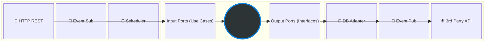
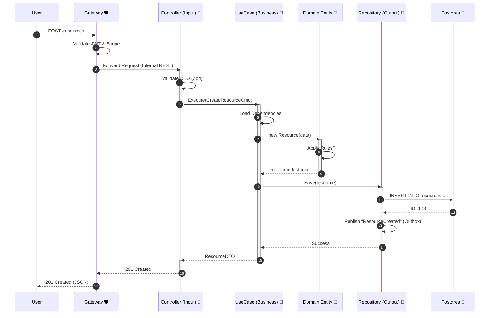

# Antigravity Framework Specification
> "The Monolith that thinks it's Microservices."

This document serves as the **Blueprint** for any large-scale project built on this codebase. It transforms the project from a simple "repo" into a strict, repeatable **Framework**.

> Template status: this repository is a **base architecture**. Services are **not required to exist yet**; they are introduced only when the project needs them.

---

## 1. Visual Architecture

### Level 1: System Landscape (The Big Picture)
This diagram shows how the pieces fit together. The **Gateway** is the only door; everything else is a private room.

```mermaid
graph TD
  %% Actors
  User((User/Client))
  External((External System))
  cron((Scheduler))

  %% Public Layer
  subgraph Public_Zone [Public Zone]
    Gateway["🛡️ B.F.F. / Gateway
    (Auth, Rate Limit, Routing)"]
  end

  %% Private Network (Template Services)
  subgraph Secure_Zone [Private Cluster (No External Access)]
    IAM["🔐 IAM
    (Users, Roles)"]
        
    ServiceA["🧩 Service A
    (Core Domain)"]
        
    ServiceB["🧩 Service B
    (Reference Data)"]
        
    ServiceC["🧩 Service C
    (Analytics/Read Models)"]
  end

  %% Infrastructure
  db[("🐘 Primary DB
  (Postgres)")]
    
  bus{{"⚡ Event Bus
  (Redis/RabbitMQ)"}}

  %% Connections
  User -->|HTTPS + JWT| Gateway
  External -->|API Key| Gateway
  cron --> Gateway
    
  Gateway -->|REST/gRPC| IAM
  Gateway -->|REST/gRPC| ServiceA
  Gateway -->|REST/gRPC| ServiceB
    
  ServiceA -->|"Event: ResourceCreated"| bus
  bus -.->|"Async"| ServiceC
    
  %% Database Access (Logically Separated)
  IAM -->|Schema: iam| db
  ServiceA -->|Schema: core| db
  ServiceB -->|Schema: ref| db
```

---

### Level 2: The Service Anatomy (The Hexagon)
Every service **MUST** look exactly like this. No exceptions. This guarantees that if you know one service, you know them all.



---

### Level 3: Request Flow (The Life of a Request)
Trace of a `POST /resources` call.



---

## 2. Directory Standard (The Rules)

For any service located in `services/<service-name>`, this structure is **MANDATORY**:

```text
src/
├── domain/                  # ❌ NO EXTERNAL LIBS
│   ├── entities/            # Core Objects (e.g., Resource.ts)
│   ├── value-objects/       # Immutable attributes (e.g., Money.ts, RNC.ts)
│   ├── errors/              # Domain-specific errors (e.g., ResourceConflictError)
│   └── ports/               # INTERFACES ONLY (The "Contracts")
│       ├── repositories/    # IResourceRepository
│       └── gateways/        # INotificationGateway
│
├── application/             # 🧠 THE ORCHESTRATOR
│   ├── use-cases/           # Verbs (CreateResource, CancelResource)
│   │   ├── CreateResource.ts
│   │   └── CreateResource.dto.ts
│   └── mappers/             # Domain <-> DTO converters
│
├── adapters/                # 🔌 THE PLUGINS (Dirty/IO Code)
│   ├── inbound/             # Driving Adapters (Input)
│   │   └── http/            # Fastify Routes & Controllers
│   └── outbound/            # Driven Adapters (Output)
│       ├── persistence/     # Implementation of Repositories (Prisma/SQL)
│       └── messaging/       # Implementation of EventPublishers
│
└── infrastructure/          # ⚙️ CONFIGURATION
    ├── config.ts            # Envs validation
    ├── container.ts         # Dependency Injection (DI) wiring
    └── server.ts            # Entry point
```

---

## 3. The 10 Commandments of the Framework
1.  **Dependency Rule**: Source code dependencies can only point **inwards**. `Domain` knows nothing about `Application`, which knows nothing about `Adapters`.
2.  **No "Models" in Domain**: Database models (Prisma/ORM) stay in `adapters/outbound/persistence`. They are mapped to `Domain Entities` before entering the core.
3.  **One Database, Logical Separation**: All services share physically one Postgres, but legally they belong to different schemas. Service A **NEVER** joins Service B's tables.
4.  **Gateway Guard**: No service is exposed to the internet directly. Only the `Apps/Gateway` has public ports.
5.  **Schema First**: Contract changes (DTOs) happen in `packages/contracts` BEFORE code is written.
6.  **Fail Fast**: Validation happens at the `Gateway` (coarse) and `Controller` (fine-grained/Zod). Bad data never reaches the Domain.
7.  **Async by Default**: If an action takes >500ms or affects another service, use **Events**.
8.  **Strict Typing**: `noImplicitAny` is ON. No `any` allowed.
9.  **Vertical Slicing**: Don't organize by "All Controllers" or "All Services". Organize by Feature/UserCase where possible.
10. **Errors are Objects**: Don't throw strings. Throw typed `DomainErrors` that map to specific HTTP codes in the adapter layer.

---

## 4. Next Steps to "Framework-ify"
To make this real, we need to:
1.  [ ] **Install Core Libs**: Add `zod` and `fastify-zod` for validation.
2.  [ ] **Setup Database**: Initialize `packages/database` (Prisma) as a shared library.
3.  [ ] **DI Container**: Implement a simple Dependency Injection mechanism in `shared-kernel` to wire Repositories to UseCases automatically.

READY TO BUILD.
